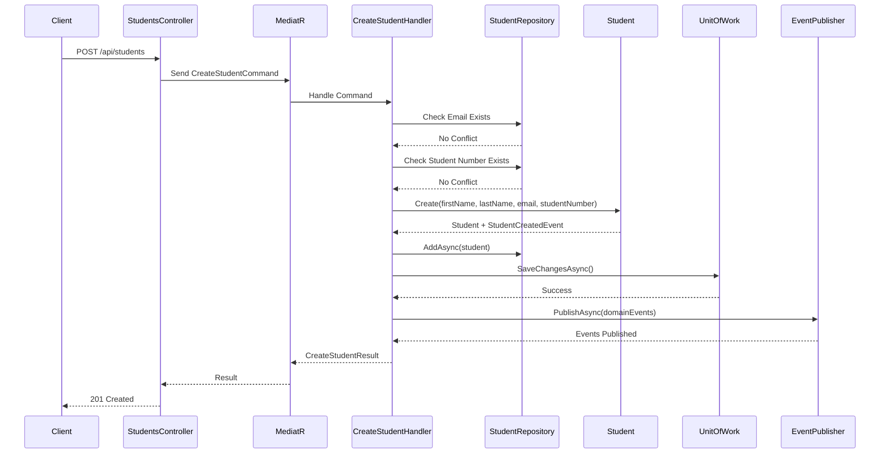
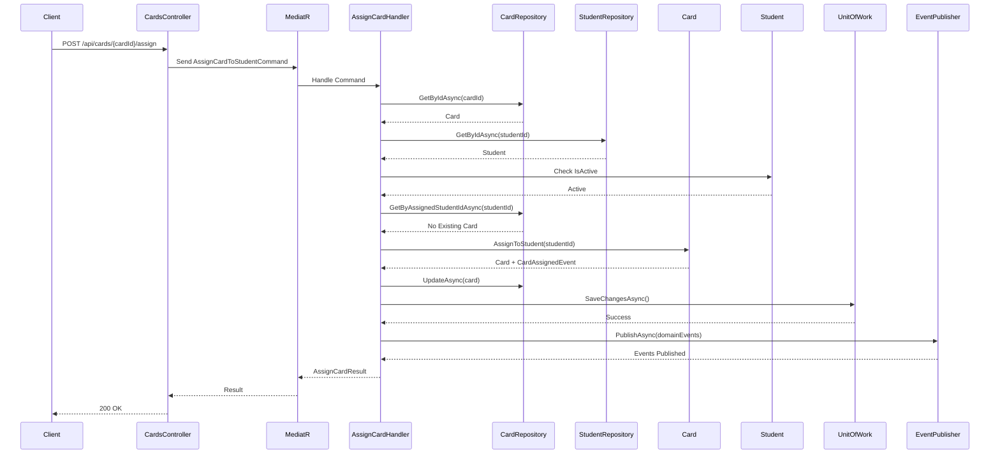
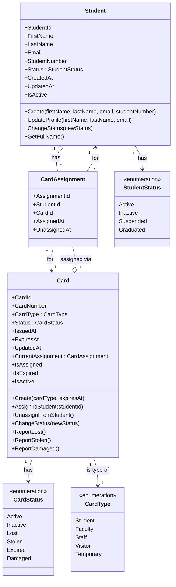
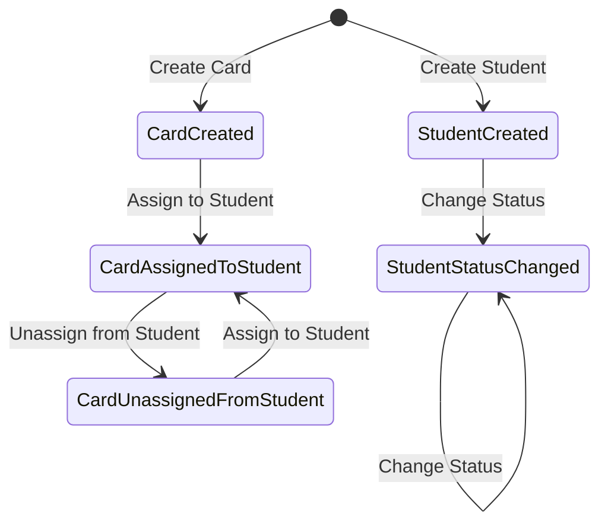
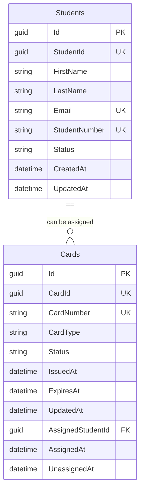
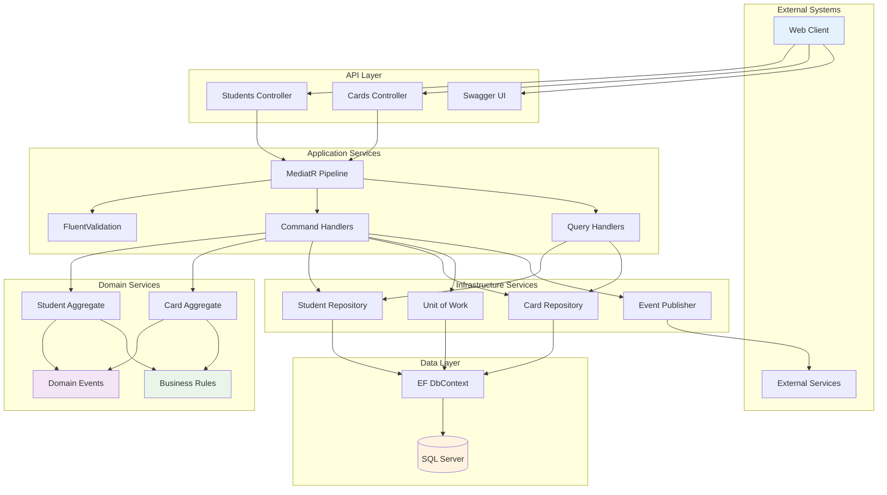

# Student Card Assignment System - Event-Driven CQRS Architecture

## 📋 Overview

This is a .NET 8 application implementing **Event-Driven CQRS (Command Query Responsibility Segregation)** with **Event Sourcing** capabilities for managing student card assignments. The system demonstrates modern architectural patterns including Domain-Driven Design, Value Objects, and event-driven projections.

## 🏗️ Architecture

### **Architectural Patterns Implemented:**

- ✅ **CQRS** - Separate read and write models
- ✅ **Event Sourcing** - Complete audit trail with reconstruction capability
- ✅ **Event-Driven Projections** - Real-time read model updates
- ✅ **Domain-Driven Design (DDD)** - Rich domain model with Value Objects
- ✅ **Clean Architecture** - Layered approach with dependency inversion

### **Layer Structure:**

```
📁 src/
├── 🌐 StudentCardAssignment.API          # HTTP API Layer
├── 📋 StudentCardAssignment.Application  # Application Services & Queries
├── 🏢 StudentCardAssignment.Domain       # Domain Logic & Events
└── 🔧 StudentCardAssignment.Infrastructure # Data Access & External Services

📁 tests/
├── 🧪 StudentCardAssignment.Domain.Tests
└── 🧪 StudentCardAssignment.Application.Tests
```

## 🔄 Event-Driven Flow

### **Complete Request Flow:**

```
📥 HTTP POST /api/students
    ↓
🎯 StudentsController.CreateStudent()
    ↓
📦 CreateStudentCommand via MediatR
    ↓
⚙️ CreateStudentCommandHandler.Handle()
    ├── Validates business rules (email/student number uniqueness)
    ├── Creates Student domain entity with Value Objects
    ├── Student.Create() raises StudentCreatedDomainEvent
    ├── Saves to domain tables (Students)
    └── Publishes domain events via MediatR
    ↓
📡 EventStoreDomainEventPublisher.PublishAsync()
    ├── Stores events in Event Store (audit trail)
    ├── Logs event to console
    └── Publishes via MediatR to trigger projections
    ↓
🔄 StudentCreatedDomainEventHandler.Handle()
    ├── Creates StudentReadModel from event data
    ├── Populates assignment fields (initially empty)
    └── Saves to read model table (StudentReadModels)
    ↓
✅ HTTP 201 Created Response
```

## 📊 Data Architecture

### **Dual Storage Pattern:**

#### **Write Side (Domain Tables):**

```sql
-- Normalized domain entities
Students (StudentId, FirstName, LastName, Email, StudentNumber, Status, ...)
Cards (CardId, CardNumber, CardType, Status, ...)
CardAssignments (Id, StudentId, CardId, AssignedAt, IsActive, ...)
EventStore (Id, AggregateId, EventType, EventData, Version, ...)
```

#### **Read Side (Projections):**

```sql
-- Denormalized for fast queries
StudentReadModels (
    Id, StudentId, FirstName, LastName, FullName, Email,
    StudentNumber, Status, HasAssignedCard, AssignedCardId,
    AssignedCardNumber, AssignedAt, CreatedAt, UpdatedAt
)

CardReadModels (
    Id, CardId, CardNumber, CardType, Status,
    IsAssigned, AssignedStudentId, AssignedStudentName,
    AssignedAt, CreatedAt, UpdatedAt
)
```

## 🎯 Value Objects Implementation

### **Rich Domain Model with Type Safety:**

```csharp
// ✅ Value Objects for business concepts
public class PersonName : ValueObject
{
    public string Value { get; }

    public static PersonName Create(string name)
    {
        // Validates: length, format, characters
        // Normalizes: "john doe" → "John Doe"
    }
}

public class Email : ValueObject { /* Email validation & formatting */ }
public class StudentNumber : ValueObject { /* Student number business rules */ }
public class StudentId : ValueObject { /* Strongly-typed ID */ }
```

### **Benefits:**

- 🛡️ **Type Safety** - Prevents parameter mix-ups
- ✅ **Validation** - Business rules enforced at creation
- 🔄 **Normalization** - Consistent formatting ("john" → "John")
- 📋 **Self-Documentation** - Domain concepts are explicit

## 🔄 Event Sourcing & Reconstruction

### **Full Event Sourcing Capability:**

```csharp
// Reconstruct Student from event history
var events = await _eventStore.GetEventsAsync(studentId);
var student = Student.LoadFromHistory(events);

// Event application pattern
student.ApplyEvent(new StudentCreatedDomainEvent(...));
student.ApplyEvent(new StudentStatusChangedDomainEvent(...));
```

### **Repository Options:**

#### **1. EF Core Repository (Default - Fast Queries):**

```csharp
public class StudentRepository : IStudentRepository
{
    // Uses EF Core for normal CRUD operations
    // Fast queries, familiar pattern
}
```

#### **2. Event-Sourced Repository (Audit & Recovery):**

```csharp
public class EventSourcedStudentRepository : IStudentRepository
{
    // Reconstructs aggregates from event history
    // Complete audit trail, time travel capability
}
```

#### **3. Read Model Repository (Optimized Queries):**

```csharp
public class StudentReadModelRepository
{
    // Uses projections for fast, complex queries
    // Denormalized data for performance
}
```

## 📋 API Endpoints

### **Students:**

```http
GET    /api/students           # List all students (uses read model)
GET    /api/students/{id}      # Get student by ID (uses read model)
POST   /api/students           # Create new student (triggers events)
```

### **Cards:**

```http
GET    /api/cards              # List all cards (uses read model)
POST   /api/cards              # Create new card (triggers events)
POST   /api/cards/{id}/assign  # Assign card to student (triggers events)
```

### API Flow Diagrams

#### Create Student Flow



#### Assign Card to Student Flow



## Getting Started

### **Prerequisites:**

- .NET 8 SDK
- SQL Server (LocalDB or full instance)
- Visual Studio 2022 or VS Code

### **Setup:**

```bash
# 1. Clone and navigate to project
cd d:\dotnet\stcourseassignmnet

# 2. Restore packages
dotnet restore

# 3. Build solution
dotnet build

# 4. Create database and apply migrations
cd src\StudentCardAssignment.Infrastructure
dotnet ef database update --startup-project ..\StudentCardAssignment.API

# 5. Run the API
cd ..\StudentCardAssignment.API
dotnet run
```

### **Access:**

- **API:** http://localhost:5000
- **Swagger UI:** http://localhost:5000/swagger

## 🧪 Testing the System

### **1. Create a Student:**

```http
POST http://localhost:5000/api/students
Content-Type: application/json

{
    "firstName": "John",
    "lastName": "Doe",
    "email": "john.doe@university.edu",
    "studentNumber": "STU001"
}
```

### **2. Verify Event-Driven Projections:**

```http
# Check if student appears in read model
GET http://localhost:5000/api/students

# Verify console logs show event publishing
# Check database tables: Students (domain) & StudentReadModels (projection)
```

### **3. Create and Assign Card:**

```http
# Create card
POST http://localhost:5000/api/cards
Content-Type: application/json

{
    "cardType": "Access",
    "expiresAt": "2025-12-31T23:59:59Z"
}

# Assign to student
POST http://localhost:5000/api/cards/{cardId}/assign
Content-Type: application/json

{
    "studentId": "{studentId}"
}
```

## Advanced Features

### **1. Event Store:**

- Complete audit trail of all domain events
- Optimistic concurrency control
- Event versioning and metadata
- JSON serialization of event data

### **2. Value Object Validation:**

- Name normalization ("john doe" → "John Doe")
- Email format validation
- Student number business rules
- Type safety throughout the domain

### **3. Projection Management:**

- Automatic read model updates via events
- Eventual consistency guarantees
- Error handling and retry logic
- Performance optimized indexes

## Future Enhancements

### **Potential Improvements:**

- 📊 **Event Store UI** - Visual event browser
- 🔍 **Advanced Queries** - Full-text search, filtering
- 📈 **Analytics** - Student/card usage metrics
- 🔄 **Event Replay** - Rebuild projections from events
- 🌐 **Multi-Tenancy** - Support multiple organizations
- 📱 **Real-time Updates** - SignalR for live updates

---

## Domain Model

### Student Aggregate

- **Student**: Main aggregate root representing a student
- **Value Objects**: StudentId, Email, StudentNumber
- **Domain Events**: StudentCreated, StudentStatusChanged

### Card Aggregate

- **Card**: Main aggregate root representing a student card
- **Value Objects**: CardId, CardNumber, CardAssignment
- **Domain Events**: CardCreated, CardAssignedToStudent, CardUnassignedFromStudent, CardStatusChanged

### Domain Model Diagram



### Domain Events Flow



## Key Features

### Student Management

- Create students with unique email and student number
- Update student profile information
- Change student status (Active, Inactive, Suspended, Graduated)
- Domain events for student lifecycle changes

### Card Management

- Create cards with different types (Student, Faculty, Staff, Visitor, Temporary)
- Assign cards to students with business rule validation
- Unassign cards from students
- Domain events for card lifecycle and assignment changes

### Business Rules

- Students must have unique email addresses and student numbers
- Only active students can be assigned cards
- Students can only have one active card at a time
- Cards cannot be assigned if they are inactive or expired
- Deactivating a card automatically unassigns it from the student

### Database Schema



### Component Interaction



## Contributing

1. Follow the established project structure
2. Write unit tests for new features
3. Ensure domain events are published for state changes
4. Follow CQRS patterns for commands and queries
5. Validate business rules in domain entities
